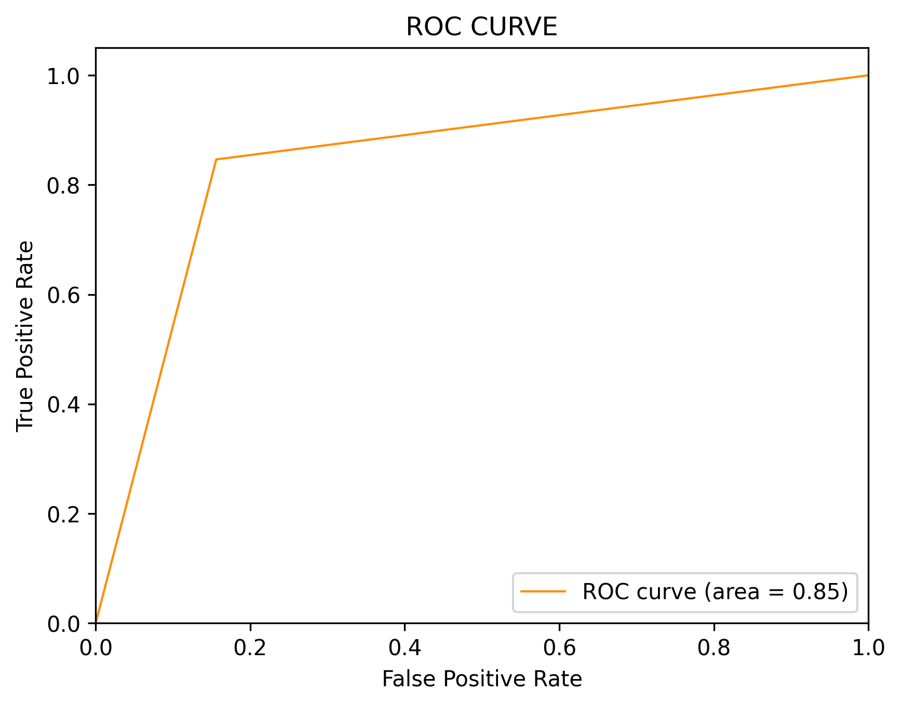

# README: Sentiment Analysis of Reddit Posts for Premier League Teams

## Overview
This project performs sentiment analysis on Reddit posts related to the 20 Premier League soccer teams. The posts are scraped using the PRAW (Python Reddit API Wrapper) library, and the data is then preprocessed, cleaned, and analyzed using machine learning techniques to classify the sentiment as either positive or negative. We use a variety of machine learning models, including traditional methods like Naive Bayes, Logistic Regression, and advanced models like DistilBERT.

## Data Collection
The Reddit posts for the 20 Premier League teams are gathered using PRAW. The script fetches the most recent posts and their comments from subreddits dedicated to each team. This dataset is stored in a CSV file: `reddit_soccer_dataset.csv`.

## Table of Contents
1. [Introduction](#introduction)
2. [Data Preprocessing](#data-preprocessing)
3. [Model Implementations](#model-implementations)
   - [BERT](#bert)
   - [Multinomial Naive Bayes (BNB)](#multinomial-naive-bayes-bnb)
   - [Logistic Regression (LR)](#logistic-regression-lr)
4. [Evaluation Metrics](#evaluation-metrics)
5. [Analysis Plots](#analysis-plots)
6. [Conclusion](#conclusion)

---

## Introduction
In this analysis, we explore three different models for performing text classification on a dataset. Each model is evaluated using common machine learning metrics such as accuracy, precision, recall, F1-score, and AUC. The primary objective is to understand how well each model performs on the given dataset and identify any strengths or weaknesses that may influence their use in practical applications.

---

## Data Preprocessing
Before applying machine learning models, the text data was cleaned and preprocessed. The following preprocessing steps were applied:
1. **Tokenization**: Texts were split into words or tokens.
2. **Lowercasing**: All text was converted to lowercase to ensure uniformity.
3. **Stopword Removal**: Common stopwords (e.g., "the", "is", etc.) were removed.
4. **Lemmatization**: Words were reduced to their base forms (e.g., "running" → "run").
5. **Vectorization**: Text was transformed into numerical features using techniques such as TF-IDF.

---

## Model Implementations

### BERT
BERT (Bidirectional Encoder Representations from Transformers) is a transformer-based model pre-trained on large corpora of text. It excels at understanding the context of words in a sentence and can achieve state-of-the-art performance in various natural language processing tasks.

1. **Preprocessing**: Tokenization was done using BERT’s tokenizer.
2. **Training**: The model was fine-tuned on the labeled dataset using cross-entropy loss.

**Evaluation Results for BERT:**

### Multinomial Naive Bayes (BNB)
BNB is a probabilistic classifier based on Bayes' theorem, typically used for text classification. It assumes that the features (words) are conditionally independent, given the class.

1. **Preprocessing**: Text was vectorized using TF-IDF.
2. **Training**: The model was trained using the Naive Bayes classifier.

**Evaluation Results for BNB:**

### Logistic Regression (LR)
Logistic Regression is a linear model that predicts the probability of a class based on a linear combination of input features. It is widely used for binary and multiclass classification tasks.

1. **Preprocessing**: TF-IDF was used for vectorization.
2. **Training**: The model was trained using logistic regression with regularization.

**Evaluation Results for LR:**

---

## Evaluation Metrics
Each model's performance was evaluated using the following metrics:
- **Accuracy**: The proportion of correctly predicted instances out of the total instances.
- **Precision**: The proportion of true positive predictions among all positive predictions.
- **Recall**: The proportion of true positive predictions among all actual positives.
- **F1-Score**: The harmonic mean of precision and recall, providing a balance between the two.
- **AUC**: The area under the receiver operating characteristic curve, indicating the model's ability to discriminate between the classes.

---

## Analysis Plots

The following analysis plots visualize the performance of each model:

1. **Confusion Matrix for BERT**  
   

2. **Confusion Matrix for BNB**  
   

3. **Confusion Matrix for LR**  
   

4. **ROC Curve for BERT**  
   

5. **ROC Curve for BNB**  
   

6. **ROC Curve for LR**  
   

These plots provide a visual representation of each model's performance across different classification metrics, helping us understand how well each model differentiates between classes and handles misclassifications.

---

## Conclusion of Model Picking

Based on the evaluation metrics and analysis plots, we can draw the following conclusions:

- **BERT** outperforms both **BNB** and **LR** in terms of accuracy, precision, recall, F1-score, and AUC. Its ability to understand the context of text makes it a strong choice for text classification tasks.
- **BNB** performs well but lags behind the other two models in terms of recall and AUC. It is a simpler model that is computationally more efficient.
- **LR** strikes a balance between performance and computational efficiency, though it slightly underperforms compared to BERT.

## Model Selection and Final Analysis

### 1. Sentiment Analysis and Comparison with FanDuel Money Line Values
After training the DistilBERT model, we used it to perform sentiment analysis on a new dataset of Reddit posts, which we called the "Reddit Rising" dataset. This dataset contained recent posts related to the Premier League teams, and we applied the trained model to predict the sentiment for each post. The sentiment scores were aggregated by team, resulting in an average sentiment score for each team.

### 2. Final Results and Insights
The final step involved comparing the sentiment analysis results with the current FanDuel money line values, which indicate the odds or expectations for each team. By comparing team sentiment (as derived from the Reddit posts) with the betting odds, we sought to uncover any potential correlations or discrepancies between how fans feel about a team and the odds provided by FanDuel.

This analysis allows us to gauge whether the sentiment of the fan base is aligned with the betting markets. If a significant mismatch is identified, it may suggest a potential opportunity for betting or further investigation into factors affecting fan sentiment or team performance.

The results from this analysis will be useful for understanding the relationship between public sentiment and betting behavior, providing valuable insights for both sports enthusiasts and bettors.